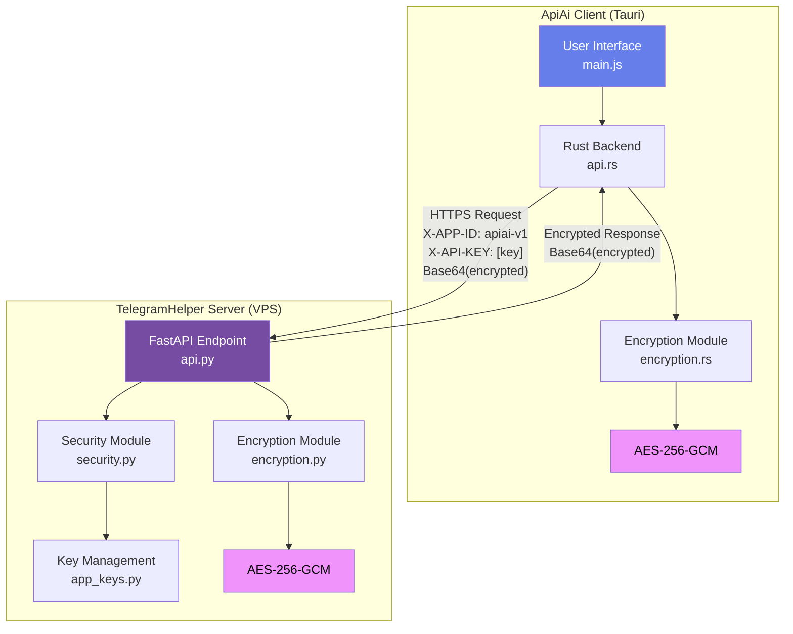
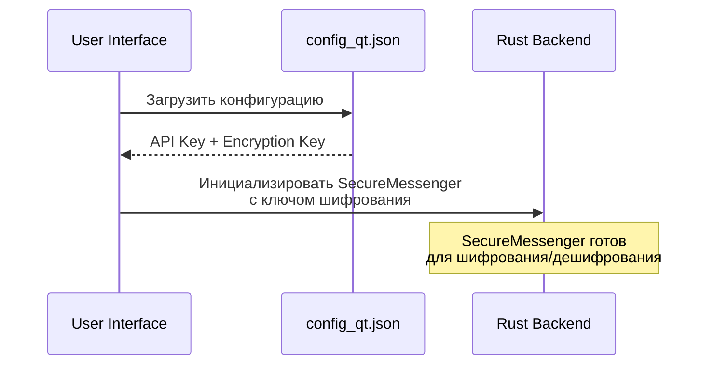
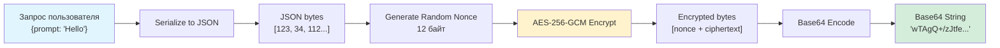
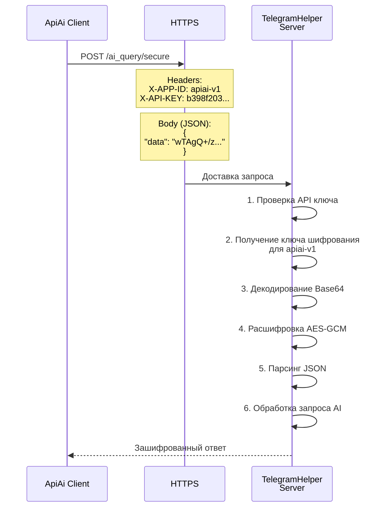
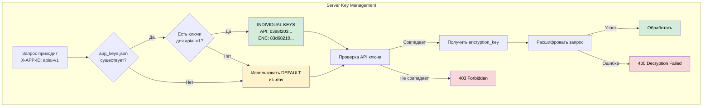
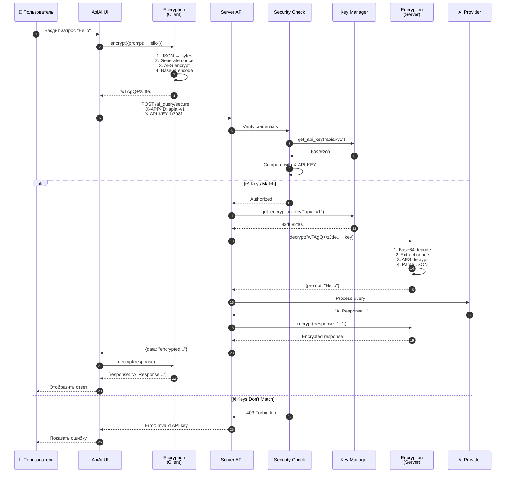
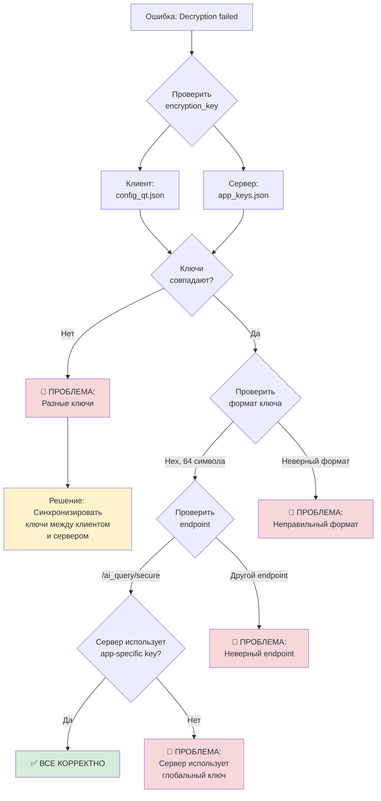

# 📘 ApiAi Encryption Architecture Guide

> **Шпаргалка по архитектуре шифрования и работе с ключами**

## 🎯 Общая архитектура



## 🔐 Как работает шифрование

### 1️⃣ Этап подготовки (Клиент)



**Что происходит:**
1. При запуске приложения загружается `config_qt.json`
2. Из него извлекаются:
   - `telegram_key` → API ключ для аутентификации
   - `telegram_enc_key` → Ключ шифрования (hex 64 символа)
   - `telegram_url` → URL сервера
3. Создается экземпляр `SecureMessenger` с ключом шифрования

### 2️⃣ Процесс шифрования запроса



**Детали шифрования:**
- **Алгоритм**: AES-256-GCM (Authenticated Encryption)
- **Размер ключа**: 256 бит (32 байта, 64 hex символа)
- **Nonce**: 12 байт (генерируется случайно для каждого сообщения)
- **Формат пакета**: `[nonce(12 байт)][ciphertext + auth_tag]`
- **Кодирование**: Base64 для передачи по HTTP

### 3️⃣ Отправка запроса на сервер



### 4️⃣ Управление ключами на сервере



**Приоритет ключей:**
1. **Individual keys** из `app_keys.json` (для конкретного app_id)
2. **Default keys** из переменных окружения `.env`

**Файл app_keys.json структура:**
```json
{
  "app_keys": {
    "apiai-v1": {
      "api_key": "b398f203ffb4a57afe3c5eff4239151404c85b8803507a58dca8ed64becfd392",
      "encryption_key": "83d68210ec84a39e2c3eb82a7a6b7afe488ae5684d45a8546c22b1fc0016cb10",
      "name": "ApiAi Experimental Rust version",
      "created_at": "2025-12-01T19:43:09.823466"
    }
  }
}
```

## 🔄 Полный цикл запроса



## 🛠️ Устранение проблем

### Ошибка: "Decryption failed"



### Ошибка: "Invalid API key" (403)

**Причины:**
1. API ключ в `config_qt.json` не совпадает с `app_keys.json` на сервере
2. `X-APP-ID` заголовок не передается или неправильный
3. На сервере нет ключей для указанного app_id

**Решение:**
1. Проверить ключ на сервере:
   ```bash
   ssh root@138.124.19.67
   cd /opt/TelegramHelper
   python3 scripts/show_keys.py --app-id apiai-v1
   ```

2. Скопировать правильный ключ в `config_qt.json`:
   ```json
   "telegram_key": "b398f203ffb4a57afe3c5eff4239151404c85b8803507a58dca8ed64becfd392"
   ```

## 📊 Сравнение ключей

### ❌ НЕПРАВИЛЬНО (Default keys)

```
┌─────────────────────────────────────────────────────────────┐
│ CLIENT (config_qt.json)                                     │
├─────────────────────────────────────────────────────────────┤
│ API Key:        13ab4a4f0c5d57ecf93727ad684f1ac46f359...   │
│ Encryption Key: 31d3636f5edb72ead0ccf07de041c5f24f530...   │
└─────────────────────────────────────────────────────────────┘
                              ↓ ❌ MISMATCH
┌─────────────────────────────────────────────────────────────┐
│ SERVER (app_keys.json → apiai-v1)                           │
├─────────────────────────────────────────────────────────────┤
│ API Key:        b398f203ffb4a57afe3c5eff4239151404c85b...   │
│ Encryption Key: 83d68210ec84a39e2c3eb82a7a6b7afe488ae...   │
└─────────────────────────────────────────────────────────────┘
```

### ✅ ПРАВИЛЬНО (Individual keys for apiai-v1)

```
┌─────────────────────────────────────────────────────────────┐
│ CLIENT (config_qt.json)                                     │
├─────────────────────────────────────────────────────────────┤
│ API Key:        b398f203ffb4a57afe3c5eff4239151404c85b...   │
│ Encryption Key: 83d68210ec84a39e2c3eb82a7a6b7afe488ae...   │
└─────────────────────────────────────────────────────────────┘
                              ↓ ✅ MATCH
┌─────────────────────────────────────────────────────────────┐
│ SERVER (app_keys.json → apiai-v1)                           │
├─────────────────────────────────────────────────────────────┤
│ API Key:        b398f203ffb4a57afe3c5eff4239151404c85b...   │
│ Encryption Key: 83d68210ec84a39e2c3eb82a7a6b7afe488ae...   │
└─────────────────────────────────────────────────────────────┘
```

## 🔧 Генерация новых ключей

Если нужно создать новые ключи для нового приложения:

```bash
# На сервере
ssh root@138.124.19.67
cd /opt/TelegramHelper

# Генерация ключей для нового app_id
python3 scripts/generate_keys.py --app-id my-new-app --name "My Application"
```

Это создаст:
- Новый случайный API ключ (64 hex символа)
- Новый случайный ключ шифрования (64 hex символа)
- Запись в `app_keys.json`

## 📝 Конфигурационные файлы

### Клиент: config_qt.json

```json
{
  "pin": "1234",
  "api_keys": {
    "anthropic": "",
    "openai": "",
    "telegram_url": "http://138.124.19.67:8000/ai_query",
    "telegram_key": "b398f203ffb4a57afe3c5eff4239151404c85b8803507a58dca8ed64becfd392",
    "telegram_enc_key": "83d68210ec84a39e2c3eb82a7a6b7afe488ae5684d45a8546c22b1fc0016cb10",
    "telegram_use_encryption": true
  }
}
```

**Важные поля:**
- `telegram_url` - URL сервера (может быть полным URL или host:port)
- `telegram_key` - API ключ для аутентификации
- `telegram_enc_key` - Ключ шифрования (HEX, 64 символа)
- `telegram_use_encryption` - Включить/выключить шифрование

### Сервер: app_keys.json

```json
{
  "default": {
    "api_key": "test_secret_key_32_bytes_long_12345",
    "encryption_key": "test_secret_key_32_bytes_long_12345"
  },
  "app_keys": {
    "apiai-v1": {
      "api_key": "b398f203ffb4a57afe3c5eff4239151404c85b8803507a58dca8ed64becfd392",
      "encryption_key": "83d68210ec84a39e2c3eb82a7a6b7afe488ae5684d45a8546c22b1fc0016cb10",
      "name": "ApiAi Experimental Rust version",
      "created_at": "2025-12-01T19:43:09.823466"
    },
    "bomcategorizer-v5": {
      "api_key": "7ec64a14...c3cb72bf",
      "encryption_key": "cc1f0e4b...cd05d41f8",
      "name": "BOM Categorizer Modern Edition v5",
      "created_at": "2025-12-02T07:20:07.823466"
    }
  }
}
```

## 🎓 Ключевые концепции

### 1. App ID
- Уникальный идентификатор приложения (например, `apiai-v1`)
- Передается в заголовке `X-APP-ID`
- Используется для поиска индивидуальных ключей

### 2. Двухуровневая аутентификация
1. **API Key** - аутентификация приложения
2. **Encryption Key** - шифрование данных

Оба ключа должны совпадать!

### 3. AES-256-GCM
- **Authenticated Encryption** - шифрование + проверка подлинности
- **256-bit key** - высокий уровень безопасности
- **GCM mode** - Galois/Counter Mode (быстрый и безопасный)
- **Nonce** - уникален для каждого сообщения

### 4. Endpoints

| Endpoint | Шифрование | App-specific keys |
|----------|------------|-------------------|
| `/ai_query` | Опционально | ✅ Да (если data поле) |
| `/ai_query/secure` | Обязательно | ✅ Да |
| `/ai_query/encrypted` | Обязательно (binary) | ✅ Да |

## 🚀 Быстрая проверка

### Проверить текущие ключи на сервере:
```bash
ssh root@138.124.19.67 "cd /opt/TelegramHelper && python3 scripts/show_keys.py --app-id apiai-v1"
```

### Проверить ключи в клиенте:
```bash
# На Mac
cat /Users/olgazaharova/Project/ApiAi/config_qt.json | jq '.api_keys | {telegram_key, telegram_enc_key}'
```

### Проверить, что сервер работает:
```bash
curl http://138.124.19.67:8000/health
```

## 📚 Дополнительные ресурсы

- [encryption.rs](file:///Users/olgazaharova/Project/ApiAi/tauri-app/src-tauri/src/encryption.rs) - Клиентское шифрование (Rust)
- [encryption.py](file:///Users/olgazaharova/Project/ProjectPython/TelegramHelper/encryption.py) - Серверное шифрование (Python)
- [api.rs](file:///Users/olgazaharova/Project/ApiAi/tauri-app/src-tauri/src/api.rs#L160-L234) - Клиентский API
- [api.py](file:///Users/olgazaharova/Project/ProjectPython/TelegramHelper/api.py#L639-L705) - Серверный endpoint
- [security.py](file:///Users/olgazaharova/Project/ProjectPython/TelegramHelper/security.py) - Модуль безопасности
- [app_keys.py](file:///Users/olgazaharova/Project/ProjectPython/TelegramHelper/app_keys.py) - Управление ключами
