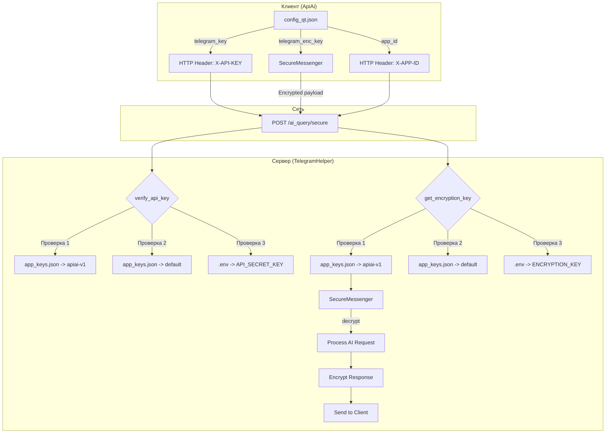

# 🔑 Управление Ключами API и Шифрования

## Обзор

Документ описывает систему хранения и применения API ключей и ключей шифрования для связки **ApiAi (клиент)** ↔ **TelegramHelper (сервер)**.

---

## Архитектура Хранения Ключей

### 📍 Клиент (ApiAi)

**Расположение:** `config_qt.json` (или `~/.config/apiai/config_qt.json`)

```json
{
  "api_keys": {
    "telegram_url": "http://138.124.19.67:8000/ai_query",
    "telegram_key": "b398f203ffb4a57afe3c5eff4239151404c85b8803507a58dca8ed64becfd392",
    "telegram_enc_key": "83d68210ec84a39e2c3eb82a7a6b7afe488ae5684d45a8546c22b1fc0016cb10",
    "telegram_use_encryption": true,
    "app_id": "apiai-v2"
  },
  "telegram_security": {
    "app_id": "apiai-v2",
    "enable_signature": true,
    "verify_ssl": true
  }
}
```

**Назначение полей:**
- `telegram_key` — API ключ для аутентификации (отправляется в заголовке `X-API-KEY`)
- `telegram_enc_key` — Ключ шифрования AES-256-GCM (64 hex символа)
- `app_id` — Идентификатор приложения (отправляется в заголовке `X-APP-ID`)

---

### 📍 Сервер (TelegramHelper)

#### Уровень 1: Переменные окружения (`.env`)

**Расположение:** `/opt/TelegramHelper/.env` (или локально `.env`)

```bash
# Дефолтные ключи (fallback для всех приложений)
API_SECRET_KEY=your_very_long_random_secret_key_here_64_chars_minimum
ENCRYPTION_KEY=default_encryption_key_64_hex_characters_here

# Telegram Bot
BOT_TOKEN=1234567890:ABCdefGHIjklMNOpqrsTUVwxyz

# AI провайдеры
ANTHROPIC_API_KEY=sk-ant-api03-xxx
OPENAI_API_KEY=sk-xxx
DEFAULT_AI_PROVIDER=anthropic
```

**Важно:**
- ✅ Файл `.env` монтируется в Docker контейнер через `volumes`
- ✅ При `docker compose down` файл **остаётся** на хосте
- ✅ Скрипт `change_token.sh` **только редактирует** `.env`, не удаляет

#### Уровень 2: Индивидуальные ключи (`app_keys.json`)

**Расположение:** `/opt/TelegramHelper/app_keys.json`

```json
{
  "app_keys": {
    "apiai-v1": {
      "api_key": "b398f203ffb4a57afe3c5eff4239151404c85b8803507a58dca8ed64becfd392",
      "encryption_key": "83d68210ec84a39e2c3eb82a7a6b7afe488ae5684d45a8546c22b1fc0016cb10",
      "created_at": "2025-12-01T15:30:00",
      "updated_at": "2025-12-01T15:30:00"
    },
    "apiai-v2": {
      "api_key": "702fe6e5...985e5d4f",
      "encryption_key": "be14d320...ae9acf90",
      "created_at": "2025-12-02T10:00:00",
      "updated_at": "2025-12-02T10:00:00"
    },
    "bomcategorizer-v5": {
      "api_key": "a1b2c3d4...e5f6g7h8",
      "encryption_key": "9i0j1k2l...3m4n5o6p",
      "created_at": "2025-11-30T12:00:00",
      "updated_at": "2025-11-30T12:00:00"
    }
  },
  "default": {
    "api_key": "default_api_key_from_env",
    "encryption_key": "default_encryption_key_from_env"
  }
}
```

**Важно:**
- ✅ Файл также монтируется в Docker: `./app_keys.json:/app/app_keys.json`
- ✅ При `docker compose down` файл **остаётся** на хосте
- ✅ Скрипт `change_token.sh` **НЕ ТРОГАЕТ** этот файл, только устанавливает права `666`

---

## Приоритет Ключей (Fallback механизм)

Сервер проверяет ключи в следующем порядке:

### 1️⃣ Индивидуальные ключи для `app_id`

```python
# app_keys.py
def get_api_key(app_id: str = None):
    # 1. Проверяем app_keys.json -> app_keys -> app_id
    if app_id in app_keys:
        return app_keys[app_id]["api_key"]
```

**Пример:**  
Запрос с `X-APP-ID: apiai-v1` → использует `b398f203...becfd392`

### 2️⃣ Дефолтные ключи из `app_keys.json`

```python
# 2. Проверяем app_keys.json -> default
default_key = data.get("default", {}).get("api_key")
if default_key:
    return default_key
```

### 3️⃣ Переменные окружения (`.env`)

```python
# 3. Последний fallback - .env файл
return os.getenv("API_SECRET_KEY")
```

---

## Как Применяются Ключи

### 🔐 API Ключ (Authentication)

**Клиент → Сервер:**

```http
POST /ai_query/secure HTTP/1.1
Host: 138.124.19.67:8000
X-API-KEY: b398f203ffb4a57afe3c5eff4239151404c85b8803507a58dca8ed64becfd392
X-APP-ID: apiai-v1
Content-Type: application/json

{"data": "base64_encrypted_payload"}
```

**Проверка на сервере:**

```python
# security.py
def verify_api_key(x_api_key: str, x_app_id: str):
    # Получаем ключ для app_id (с fallback)
    expected_key = get_api_key(x_app_id)
    
    if x_api_key != expected_key:
        raise HTTPException(status_code=403, detail="Invalid API key")
```

### 🔒 Ключ Шифрования (Encryption)

**Клиент (шифрование запроса):**

```rust
// api.rs
let messenger = SecureMessenger::new(&encryption_key);
let encrypted_bytes = messenger.encrypt_json(&payload)?;
let b64_data = base64::encode(&encrypted_bytes);
```

**Сервер (расшифровка):**

```python
# api.py
def process_encrypted_request(data: str, security_info: Dict):
    app_id = security_info.get("app_id")
    
    # Получаем ключ шифрования для app_id
    enc_key = get_encryption_key(app_id)
    messenger = SecureMessenger(enc_key)
    
    # Расшифровываем
    encrypted_bytes = base64.b64decode(data)
    decrypted_data = messenger.decrypt(encrypted_bytes)
```

**Сервер (шифрование ответа):**

```python
# Используем тот же ключ для ответа
response_dict = {"response": "...", "status": "success"}
encrypted_response = messenger.encrypt(response_dict)
b64_response = base64.b64encode(encrypted_response).decode('utf-8')
```

---

## Команды Управления Ключами

### Просмотр Ключей

```bash
# На сервере
cd /opt/TelegramHelper

# Все ключи
python3 scripts/show_keys.py --all

# Конкретное приложение
python3 scripts/show_keys.py --app-id apiai-v1

# С полными значениями
python3 scripts/show_keys.py --app-id apiai-v1 --full
```

**Вывод:**
```
🔑 Ключи для: apiai-v1 (ApiAi Experimental Rust version)
   📅 Создан: 2025-12-01T15:30:00
   🔄 Обновлен: 2025-12-01T15:30:00
   ✅ Индивидуальные ключи
------------------------------------------------------------
🔐 API Key: b398f203...becfd392
   Полный ключ: b398f203ffb4a57afe3c5eff4239151404c85b8803507a58dca8ed64becfd392
🔒 Encryption Key: 83d68210...0016cb10
   Полный ключ: 83d68210ec84a39e2c3eb82a7a6b7afe488ae5684d45a8546c22b1fc0016cb10
```

### Генерация Новых Ключей

**Через Telegram бота:**

```
/generate_keys apiai-v2
```

Бот создаст новую пару ключей и сохранит в `app_keys.json`.

**Вручную (Python):**

```python
import secrets

# API ключ (64 символа hex)
api_key = secrets.token_hex(32)

# Ключ шифрования (64 символа hex)
enc_key = secrets.token_hex(32)

print(f"API Key: {api_key}")
print(f"Encryption Key: {enc_key}")
```

**Вручную (OpenSSL):**

```bash
# API ключ
openssl rand -hex 32

# Ключ шифрования
openssl rand -hex 32
```

---

## Безопасность при Деплое

### ✅ Файлы БЕЗОПАСНЫ при:

```bash
# Остановка и удаление контейнеров
docker compose down

# Пересборка образа
docker compose build --no-cache

# Запуск новых контейнеров
docker compose up -d
```

**Почему?**

Файлы `app_keys.json` и `.env` **монтируются** (bind mount) из хост-системы:

```yaml
# compose.yaml
volumes:
  - ./app_keys.json:/app/app_keys.json
  - ./.env:/app/.env
```

При удалении контейнера, файлы на хосте **остаются нетронутыми**.

### ✅ Скрипт `change_token.sh` БЕЗОПАСЕН

Скрипт **НЕ ПЕРЕЗАПИСЫВАЕТ** `app_keys.json`:

```bash
# строки 752-761 скрипта
if [ -f "app_keys.json" ]; then
    chmod 666 app_keys.json  # Только устанавливает права
    echo "✅ Права на app_keys.json установлены (666)"
elif [ ! -f "app_keys.json" ]; then
    # Создаёт ТОЛЬКО если файла нет
    echo '{"app_keys": {}, "default": {}}' > app_keys.json
fi
```

Скрипт работает **только** с `.env` файлом (BOT_TOKEN, AI ключи).

---

## Типичные Проблемы и Решения

### ❌ "Decryption failed"

**Причина:** Ключи шифрования не совпадают на клиенте и сервере.

**Решение:**

1. Проверьте ключ на сервере:
   ```bash
   python3 scripts/show_keys.py --app-id apiai-v1 --full
   ```

2. Сравните с клиентом:
   ```json
   // config_qt.json
   "telegram_enc_key": "должен_совпадать_с_сервером"
   ```

### ❌ "Invalid API key" (403)

**Причина:** API ключ не совпадает или неверный `app_id`.

**Решение:**

1. Проверьте `app_id` в конфиге клиента:
   ```json
   "app_id": "apiai-v1"  // Должен быть в ALLOWED_APPS
   ```

2. Проверьте API ключ на сервере:
   ```bash
   python3 scripts/show_keys.py --app-id apiai-v1 --full
   ```

3. Обновите ключ в клиенте.

### ❌ После деплоя ключи "исчезли"

**Причина:** Скорее всего файл `app_keys.json` был удалён вручную или сбились права.

**Решение:**

1. Проверьте наличие файла:
   ```bash
   ls -la /opt/TelegramHelper/app_keys.json
   ```

2. Проверьте права доступа:
   ```bash
   # Должно быть: -rw-rw-rw-
   chmod 666 app_keys.json
   ```

3. Восстановите ключи через бота:
   ```
   /generate_keys apiai-v1
   ```

---

## Диаграмма Потока Ключей



---

## Рекомендации

### 🔒 Безопасность

- ✅ Используйте уникальные ключи для каждого `app_id`
- ✅ Регулярно ротируйте ключи (раз в 3-6 месяцев)
- ✅ Не храните ключи в Git репозитории
- ✅ Используйте HTTPS для дополнительной защиты
- ✅ Ограничьте доступ к серверу через firewall

### 📦 Деплой

- ✅ Всегда делайте бэкап `app_keys.json` перед обновлениями
- ✅ Проверяйте права доступа после деплоя (`chmod 666`)
- ✅ Тестируйте связь через Echo endpoint после обновлений

### 🔧 Мониторинг

- ✅ Регулярно проверяйте логи на ошибки аутентификации
- ✅ Используйте `/echo` endpoint для диагностики связи (требует X-API-KEY и X-APP-ID)
- ✅ Мониторьте время ответа (round-trip, server, network)

---

**Дата создания:** 02.12.2025  
**Автор:** Kurein M.N.  
**Версия:** 1.0
